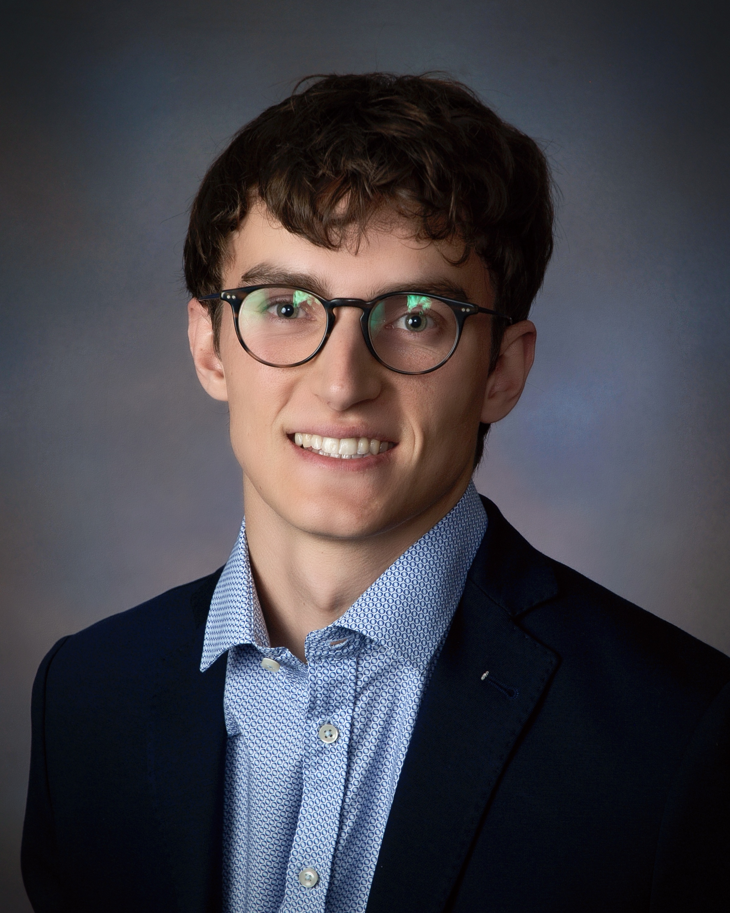
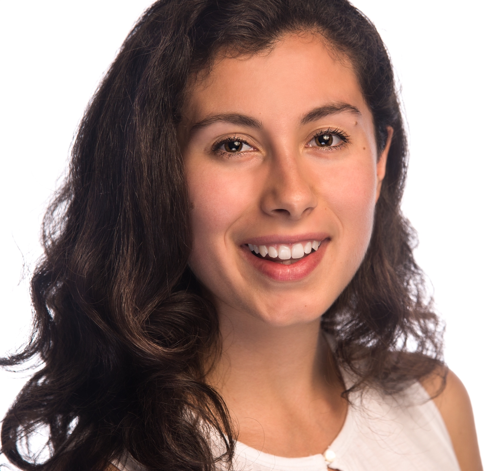

    

We are a small tutoring group based in Princeton, New Jersey with 
offerings in mathematics, science, and test preparation. Our aim is
to provide high quality tutoring services across academic
disciplines by drawing upon our expertise in scientific and medical 
research. Following the model of apprenticeship in mathematics and
science, our tutoring services are highly personal, effective, and tailored to
students' needs. Currently, we offer:

<ul>
<li> In-person and virtual tutoring services </li>
<li> One-on-one tutoring for middle school through undergraduate grades </li>
<li> SAT/ACT test preparation and college admissions counseling </li>
</ul>

Exact offerings are tutor dependent and 
are described below.

<h2 style="margin-top: 15px;">
Biographical Information 
</h2>

    

 
<a href="https://www.henricschmidt.com">Henri Schmidt </a>
is a PhD candidate in the Department of Computer Science 
at <a href="https://princeton.edu">Princeton University</a>. Previously, Henri received a B.S. in Mathematics
and Computer Science from <a href="https://tufts.edu">Tufts University</a>. He has extensive teaching experience
having served as a teaching assistant for courses in computer science for over 
eight semesters. Henri has also tutored students in mathematics and computer 
science in both professional and volunteer capacities.

Currently, Henri offers tutoring and consulting in:

<ul style="font-size: 0.9em; margin-top: -10px;">
<li> Grade-school mathematics: Algebra, Geometry, Trigonometry, AP Calculus, and AP Statistics </li>
<li> Undergraduate computer science and mathematics: Calculus, Linear Algebra, Real Analysis, Data Structures, etc. </li>
<li> Introduction to Programming & Data Science: Python, Java, C/C++, and R </li>
<li> Test preparation for the mathematics and science sections of the SAT/ACT </li> 
</ul>

    

Isabella Kopits is a second year medical student at 
<a href="https://rwjms.rutgers.edu/">Rutgers Robert Wood Johnson Medical School</a>, where she was awarded a 
Dean’s Scholarship. She obtained her BA from <a href="https://harvard.edu">Harvard University</a>
with a degree in History of Science and 
her Master's Degree from the <a href="https://www.publichealth.columbia.edu/">Mailman School of Public Health</a> at 
<a href="https://columbia.edu">Columbia University</a>. 
Isabella has 
one year of tutoring experience and has previously served as 
the Clinical Research Coordinator at the <a href="https://www.vulvodynia.com/">Centers for Vulvovaginal 
Disorders</a> in New York.

Currently, Isabella offers tutoring and consulting in:

<ul style="font-size: 0.9em; margin-top: -10px;">
<li>Grade-school sciences and mathematics: AP Biology, AP Chemistry, and AP statistics</li>
<li>Test preparation for the Reading & Writing sections of the SAT and ACT</li>
<li>Pre-med counseling and medical school admissions counseling</li>
</ul>

<h2 style="margin-top: 15px; margin-bottom: 5px;">
Educational Philosophy 
</h2>

In the classic text on mathematical pedagogy, 
<i>How to Solve It</i>, George P&oacute;lya writes, 
<i>"Mathematics, you see, is not a spectator sport."</i> 
While effective learning of course includes aspects of spectatorship, 
e.g. in the form of lecture, we agree with P&oacute;lya that true mastery 
of a subject follows mainly from practice. Consequently, our services
incorporate practice throughout, with the foremost goal of teaching students 
to trust and rely on their own reason, intuition, and abilities. 

To realize the aim of practice-based learning, we first assess students' 
strengths and areas for  growth. Once identified, we select targeted 
problems, questions, and concepts for practice. By assisting students 
in solving and reasoning through these problems, we help hone their intuition and problem-solving skills. 
In this way, students develop the tools necessary for effective problem-solving 
and self-guided learning, becoming confident individuals prepared for future challenges.

&nbsp;
